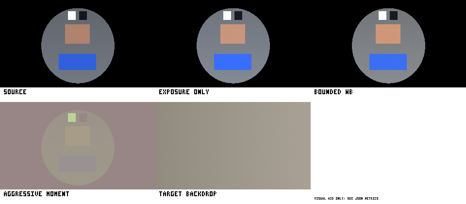

# Phase 0 visual-consistency evidence and algorithm decision

Status: **VIS-0.2 evidence complete; VIS-0.3 estimator selected.**

This report is the review record for the deterministic, non-production harness
in `tests/visual_consistency_evidence.py` and
`tests/test_visual_consistency_evidence.py`. It does not change production
geometry, color, configuration, or pipeline behavior.

The evidence fingerprint for the constants, fixtures, metrics, and decisions
below is:

`1871e8ea3c00304fd86a62d240831cb8548f99de27c53732ba20c6c7be73a5f8`

## Reproduce the evidence

From the repository root, with the development environment installed:

```bash
PYTHONPATH=src .venv/bin/pytest -q tests/test_visual_consistency_evidence.py
PYTHONPATH=src .venv/bin/python tests/visual_consistency_evidence.py \
  --deterministic-only \
  --json /tmp/custback-vis0-evidence.json \
  --contact-sheet /tmp/custback-vis0-contact-sheet.png
```

The first command is the acceptance oracle. The contact sheet shows
reference-estimator candidates; it is not a current-pipeline rendering and is
only a human review aid. Its labels use the same embedded bitmap font rather
than Pillow's version-dependent default font. No decision depends on visual
preference. Two consecutive JSON runs in the qualification environment were
byte-identical. A minimum-dependency run on Python 3.10, NumPy 1.24.0,
OpenCV 4.8.1.78, and Pillow 10.0.0 produced equal JSON, equal contact-sheet
pixels, and the same PNG bytes. The deterministic JSON file SHA-256 was
`e6ccca5dc8d29b61f60cba5576263864b64823ad3a6f12241c8430a733695c07`.
The reviewed outputs are committed as
`docs/visual-consistency-phase0-baseline.json` and
`docs/visual-consistency-phase0-contact-sheet.png`; the contact-sheet SHA-256
is `fbcc4b9c713e393e5a08ce531b8c89d4f1b4da5311412ec5e87ad134a7fc7f85`.



To add host-observed timings:

```bash
PYTHONPATH=src .venv/bin/python tests/visual_consistency_evidence.py \
  --json /tmp/custback-vis0-full-evidence.json \
  --contact-sheet /tmp/custback-vis0-contact-sheet.png \
  --timing-iterations 30
```

Host timings are intentionally excluded from the deterministic fingerprint.

## Fixture inventory and provenance

All input fixtures are generated in memory. No binary input fixture or
third-party profile is committed. The committed PNG is generated review
output, and its pixel parity is enforced by the test suite.

### Geometry

The generator produces:

| Case | Height × width |
| --- | ---: |
| Square | 201 × 201 |
| 4:3 | 240 × 320 |
| 16:9 | 180 × 320 |
| Portrait | 320 × 180 |
| Ultrawide | 144 × 384 |
| Odd-sized | 181 × 319 |

Each frame has four bitmap-labeled corners, three non-symmetric horizontal and
vertical grid positions, a non-centered circle/face-outline target, and an
asymmetric coordinate-dependent fill. The labels use an embedded pixel font,
so the fixture does not depend on system fonts. EXIF orientations 1 through 8
are applied and tested for expected shape and inverse mapping.

### Color and temporal cases

The linear-RGB generator covers:

- neutral patches under warm and cool casts;
- parameterized exposure, including ±1 EV and a clamp-driving +2 EV case;
- clipped highlights and deep shadows;
- a skin-like patch and saturated blue clothing patch;
- neutral and saturated magenta backdrops;
- deterministic static sensor noise, slow illumination drift, a hard
  warm-to-cool scene cut, a missing reconnect frame, and resumed frames.

The ICC fixture generator creates valid matrix/TRC sRGB, Display-P3, and
Adobe-RGB profiles and a small valid CMYK input LUT profile. Pillow/LittleCMS
parses every profile and converts every tagged image to generated sRGB during
the test. The synthetic CMYK LUT is a parser/transport fixture, not a
press-proofing profile.

| Profile | Container/mode | Profile SHA-256 | Generated image SHA-256 |
| --- | --- | --- | --- |
| sRGB | PNG/RGB | `5bdb783790846f04e5f97c4b0614c236961adf556a03f23068eb0959a19c71c6` | `4bad4985df6b18092c457f932e4d8267441bae30a47d976254cacb4c7427ba42` |
| Display-P3 | PNG/RGB | `76f4dae691ac878c4e8a5ce3a5ef2e6f957ccf5ea1af70873f7fe85b0f3d3bdf` | `ad8ba65c89fdad546859cb89e2d43c263924bc4bac88a1026e15ffc5c881dcb7` |
| Adobe-RGB | PNG/RGB | `0246d302d3663301656455873f9095ae512ebb4265a03dfe9be82e3068b55cb3` | `dcf4bcccf0b8ca4194f11ff7d4da86271e59da0ef520b4930058789a5995512c` |
| Synthetic CMYK | TIFF/CMYK | `f99312d78f09c5a4877f305d52f6097905f1cd606cb29a272eb76cf5c275e3ea` | `618ddd7803cf3fb034fa9ad6c34f260900be0effb07ba2243b770c02748675d1` |

The generated profiles and images are CC0 test material produced entirely by
the evidence script.

The ±1 EV exposure fixtures are exercised through the estimator rather than
listed only as inventory. Both start with an exact `1.000000 EV` gap. The
ratified clamp and strength apply `+0.425000 EV` and `−0.425000 EV`
respectively, leaving a symmetric `0.575000 EV` gap.

### Rotation-metadata video

The qualification environment had neither `ffmpeg` nor `ffprobe`, and OpenCV's
writer does not provide a portable rotation-metadata control. No fake
rotation tag is claimed. EXIF 1–8 pixel transforms are fully covered; a real
metadata-rotated video remains an optional integration fixture once a pinned
decoder/toolchain is introduced.

## Metric definitions

| Metric | Numeric definition |
| --- | --- |
| Retained aspect ratio | Horizontal scale divided by vertical scale. `1.0` is undistorted; the gate permits at most `0.01` absolute error. |
| Cover crop | Exact floating-point source rectangle and uniform scale for a requested anchor. |
| Luminance gap | Absolute difference between robust median `log2(Y)` values for foreground neutral-core and local-backdrop samples. |
| Neutral-axis error | Euclidean distance in CIELAB `a*`,`b*` between robust foreground-neutral and target-neutral medians. |
| Hue drift | Shortest angular difference between protected-patch CIELAB hue angles. |
| Chroma drift | Relative change in `C*/L*`, so intended exposure movement is not mislabeled as color corruption. |
| EV/gain jitter | P95 absolute adjacent-frame EV delta and maximum per-channel log2 gain delta over static-noise frames. |
| Scene-cut settling | First valid post-cut estimate within 0.05 EV and 0.02 gain-EV of the stable post-cut median. |
| Soft-edge luminance | Linear luminance error of the current encoded-space alpha result against a linear-light reference. |

Metrics use robust medians except for the deliberately aggressive candidate's
per-channel mean/standard-deviation transfer. Tests carry tighter tolerances
than the decision thresholds: exact integer baselines, `1e-6` for constructed
EV pairs, and fixed numeric inequalities for estimator qualification.

## Current baseline

### Camera/background geometry discrepancy

Directly resizing a 320×240 (4:3) camera frame to 320×180 (16:9) has:

- horizontal scale `1.0`;
- vertical scale `0.75`;
- axis ratio `1.333333`;
- geometric distortion `33.333%`.

The numeric distortion assertion correctly fails. In contrast, a centered
aspect-preserving `cover` fit retains a `1.0` axis ratio and crops source
coordinates `(left=0, top=30, right=320, bottom=210)`.

### Gamma-space soft-edge discrepancy

For an encoded sRGB foreground value of 200 over black at 50% alpha:

- the existing compositor returns encoded value **100**;
- the linear-light reference returns approximately **146**;
- decoding the legacy output reveals a **−55.872%** linear-luminance error at
  the soft edge.

These values are captured both through the production `composite()` function
and independent transfer-function math.

## Candidate estimator experiment

All estimators analyze only a downscaled copy whose long edge is 192 pixels.
The generated 320×180 input therefore produces a 192×108 analysis frame.
Application is evaluated on the full synthetic foreground only for metric
measurement.

Sampling rules used by the experiment:

1. Source samples come from mask confidence `>= 0.90`, eroded once with a 5×5
   kernel at analysis resolution.
2. Target samples come from a 19×19 dilated annulus outside the subject.
3. If the annulus has fewer than 96 pixels, the global outside-mask backdrop
   is the exposure fallback. Global fallback is not eligible for WB.
4. Samples with `Y <= 0.02`, any channel `>= 0.98`, or non-finite values are
   excluded from exposure and WB.
5. WB additionally requires channel saturation `<= 0.30`.
6. Exposure confidence is the product of sample-count, usable-sample-ratio,
   and mask-coverage scores. Fewer than 96 usable source/target samples or
   exposure confidence below `0.45` yields identity/no-update.
7. WB confidence multiplies exposure confidence by local neutral-sample
   availability, saturating at 96 neutral samples per side. WB also requires
   at least 96 neutral samples per side and WB confidence `>= 0.45`;
   otherwise a valid exposure estimate remains exposure-only.

The comparison scene starts with luminance gap `0.966233 EV` and neutral-axis
error `12.467391 ΔEab`.

| Candidate | Luminance gap after / reduction | Neutral error after / reduction | Skin hue / normalized chroma drift | Clothing hue / normalized chroma drift |
| --- | ---: | ---: | ---: | ---: |
| Exposure only | `0.541234 EV` / `43.985%` | `13.018840` / `−4.423%` | `0.000001°` / `2.499%` | `0.000001°` / `3.268%` |
| Bounded exposure + diagonal WB | `0.508483 EV` / `47.375%` | `9.501521` / `23.789%` | `2.155°` / `10.684%` | `1.123°` / `8.851%` |
| Aggressive moment transfer | `0.011110 EV` / `98.850%` | `0.848003` / `93.198%` | `34.158°` / `54.466%` | `73.738°` / `97.299%` |

The bounded candidate applied `+0.425 EV` and diagonal gains
`[1.077033, 1.019800, 0.927362]` after strength. Its exposure and WB
confidences were both `0.970241`
from 5,184 usable source pixels, 3,465 usable target pixels, 3,453 source
neutral pixels, and 3,465 target neutral pixels.

Exposure-only matching materially closes the luminance gap but makes the
neutral-axis error slightly worse because it cannot correct the opposing
casts. Aggressive moment transfer nearly minimizes both matching errors by
destroying the protected colors. Only bounded diagonal WB improves both
matching objectives while satisfying the preservation gates.

## Temporal and confidence evidence

The instantaneous bounded estimator produced:

| Sequence metric | Result |
| --- | ---: |
| Static-noise EV delta P95 | `0.000981 EV` |
| Static-noise maximum channel-gain delta P95 | `0.001044 EV` |
| Applied EV change over slow drift | `0.093878 EV` |
| Hard-cut instantaneous settling | `0` additional frames |
| Missing reconnect frame | no estimate |
| First valid frame after reconnect | bounded-WB estimate |

These numbers qualify the instantaneous estimator only. VIS-2.4 still owns
stateful smoothing, slew limits, freeze/decay, and reset behavior. The
instantaneous low-confidence contract is identity/no-update so a later state
machine can distinguish “hold prior state” from a new identity estimate.

Edge-case behavior is deterministic:

| Case | Behavior | Reason |
| --- | --- | --- |
| Saturated backdrop content in an otherwise eligible image/video/camera mode | Exposure only | Exposure confidence remains valid, but WB confidence is zero because there are 0 usable target-neutral pixels. The separate `background.mode: color` policy remains identity. |
| All-zero mask | Identity/no-update | No foreground core. |
| Tiny mask | Identity/no-update | Fewer than 96 eroded-core samples. |
| All-one mask | Exposure only | Global target fallback exists but no local target relationship, so WB is prohibited. |
| Fully clipped foreground core | Identity/no-update | Clipping exclusion leaves insufficient source samples. |

## Ratified VIS-0.3 decision

Select **bounded log-luminance exposure plus low-strength diagonal WB in
linear sRGB** for later production implementation.

Ratified estimator constants:

| Control | Decision |
| --- | ---: |
| Analysis long edge | `192 px` |
| Exposure clamp before strength | `−0.85 … +0.85 EV` |
| Per-channel WB clamp before strength | `0.86 … 1.16` |
| Default overall/exposure strength | `0.50` |
| Default WB log-gain strength | `0.50` |
| High-confidence mask threshold | `0.90`, then 5×5 erosion |
| Minimum usable samples per side | `96` |
| Minimum exposure confidence / WB confidence | `0.45` each |
| Near-black exclusion | `Y <= 0.02` |
| Clipping exclusion | any channel `>= 0.98` |
| Neutral saturation ceiling | `0.30` |
| Skin preservation gate | hue `<= 5°`, normalized chroma drift `<= 12%` |
| Clothing preservation gate | hue `<= 8°`, normalized chroma drift `<= 15%` |

Mode and fallback semantics to carry into the frame/color contract:

- `auto` may estimate WB only for image, video, or backdrop-camera replacement
  modes with a usable local target and foreground core.
- Saturated targets and all-one masks are exposure-only.
- All-zero/tiny masks, clipping, insufficient samples, and exposure confidence
  below `0.45` are identity/no-update. WB confidence below `0.45` selects
  exposure-only when exposure confidence remains valid.
- Blur, passthrough, solid saturated-color, and remote output remain
  correction-ineligible unless a later mode-specific qualification explicitly
  changes that rule.
- The first compatibility release keeps correction default `off`.
  Evidence supports `auto` as the qualified target default only after the
  later integration, performance, visual-corpus, and rollback gates pass.
- Full histogram/LAB moment transfer is rejected.

The above values are no longer provisional for configuration-model purposes.
Runtime changes remain subject to later implementation and qualification
phases. The preservation gates qualify the selected default strength pair
(`0.50` / `0.50`), as required by VIS-0.3; advanced strength overrides remain
bounded interpolation controls but are not claimed to reproduce those
default-setting measurements.

The two strength fields are intentionally separate even though both are `0.50`
today. `strength` interpolates the bounded exposure EV toward identity.
`white_balance_strength` independently interpolates the bounded diagonal gains
in log-gain space. They are **not multiplied together**. This prevents an
accidental effective WB strength of `0.25` and preserves the measured
`23.789%` neutral-axis improvement. It also leaves a distinct future control
for reducing WB without weakening exposure.

The Phase 0 configuration and ADR must therefore use these exact final values:

| Field/constant | Final Phase 0 value |
| --- | ---: |
| `color_correction.strength` | `0.50` |
| `color_correction.exposure_limit_ev` | `0.85` |
| `color_correction.white_balance_strength` | `0.50` |
| Fixed WB gain bounds | `0.86 … 1.16` |
| `color_correction.adaptation_time_s` | `0.8 s` |

`adaptation_time_s=0.8` is the ratified initial temporal-state configuration
default, not a value measured by this instantaneous estimator. This closes the
VIS-0.4 schema decision. VIS-2.4 must test its runtime effect using live
cadence, freeze/decay, scene-cut, and reconnect cases before `auto` can become
the default; changing it would require an explicit ADR/config amendment.

## Timing observation

The existing runtime exposes stage EWMAs through `FrameHub.stats_dict`. The
harness ran the production pipeline with a 320×180 synthetic camera,
heuristic segmentation, color backdrop, null output, and 60 FPS target. After
24 output frames the actual stats path reported:

| Production EWMA field | Value |
| --- | ---: |
| `capture_read_ms` | `0.4 ms` |
| `segmentation_ms` | `1.9 ms` |
| `background_ms` | `0.0 ms` |
| `composite_ms` | `2.0 ms` |
| `output_send_ms` | `0.0 ms` |
| `frame_processing_ms` | `4.0 ms` |

The same run reported `59.2 FPS`. These rounded values are a host observation,
not a CI threshold; the evidence test proves that the snapshot is populated
from the production stats API. The harness also records isolated
microbenchmarks for comparison.

Observed on Python 3.14.4, NumPy 2.5.1, OpenCV 5.0.0, Pillow 12.3.0,
Linux x86-64; 3 warmups and 30 measured iterations:

| Operation | Median | P95 |
| --- | ---: | ---: |
| Current direct resize, 960×720 → 1280×720 | `0.220 ms` | `0.267 ms` |
| Current backdrop cover fit, 960×720 → 1280×720 | `0.213 ms` | `0.223 ms` |
| Current legacy composite, 720p | `14.512 ms` | `15.439 ms` |
| Bounded estimator, 320×180 analyzed at 192px | `1.758 ms` | `1.888 ms` |

These are observations, not cross-host gates. VIS-4.2 must measure integrated
EWMA/p95/deadline impact at 720p and 1080p on qualification hardware.

## Later-phase handoff (not Phase 0 gaps)

1. Rotation metadata in a video is not covered because the required metadata
   writer/prober is absent. VIS-0.2 explicitly permits this when tooling is
   unavailable; EXIF 1–8 remains deterministic, and VIS-1.2 owns decoder
   integration.
2. The corpus is synthetic and intentionally adversarial. Real cameras, skin
   tones, codecs, wide-gamut assets, and auto-exposure/auto-WB loops still need
   VIS-4.2 corpus and long-run qualification.
3. The CMYK fixture proves profile transport and transform plumbing only; it
   is not a color-accuracy reference chart.
4. One synthetic production-stats snapshot does not replace VIS-4.2
   cross-platform live-camera and deadline qualification.
5. The experimental estimator is reference code, not production code.
   VIS-2.3 and VIS-2.4 own vectorized integration and bounded-memory temporal
   state while preserving the selected sampling/exclusion/confidence policy.

Closed Phase 0 reconciliations:

- the test, generator, ADR, report, implementation review, JSON, and PNG are
  present in the exact npm payload/test allow-lists, and the generator is
  explicitly included in the Python sdist manifest;
- configuration, ADR, evidence, and defaults all use the ratified
  `0.50` / `0.85` / `0.50` values;
- exposure and WB confidence now have distinct numeric evidence, including
  neutral availability;
- both production EWMA timing fields and isolated microbenchmarks are recorded.

With those integrations complete, VIS-0.2 has
numeric coverage for every required baseline/fixture class available in this
toolchain, and VIS-0.3 has no remaining provisional estimator, clamp,
confidence, preservation, fallback, or default recommendation.
